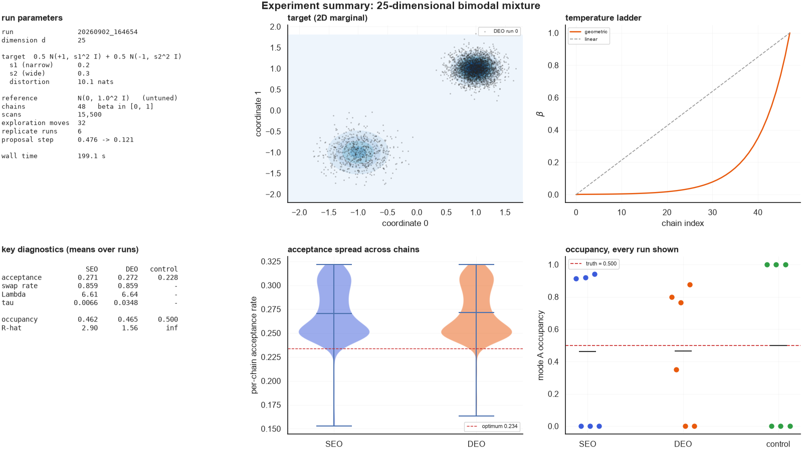

# Non-reversible parallel tempering on a bimodal target

Code and results from my URSS 2026 summer project at the
University of Warwick, supervised by Prof. Krzysztof Łatuszyński.

The project compares two ways of scheduling swaps in parallel tempering:

- **SEO** (stochastic even-odd): each scan swaps either the even or the odd
  neighbouring pairs, chosen at random. This is the classical, reversible scheme.
- **DEO** (deterministic even-odd): the parity alternates every scan, which
  makes replicas move along the ladder ballistically rather than as a random
  walk ([Syed et al., 2022](https://doi.org/10.1111/rssb.12464)).

The test target is a two-component Gaussian mixture in `d` dimensions,

    pi(x) = 0.5 N(+1_d, s1^2 I) + 0.5 N(-1_d, s2^2 I),   s1 != s2.

Both modes have weight 1/2, but because the widths differ, tempering changes
their relative weight by a factor `(s1/s2)^(d(1-beta))`. The hot chains end up
almost entirely in the wide mode, and the question is whether the round trip
rate (the usual measure of how well PT is working) notices.

Short answer: it doesn't. DEO gives the speed-up the theory predicts, but the
round trip rate and communication barrier can look healthy while the cold chain
recovers the mode weights badly. What fixes it is a better reference
distribution, not more round trips.

## Layout

```
parallel_tempering.ipynb     main notebook (saved with outputs)
scripts/chain_count_sweep.py stand-alone sweep over the number of chains
results/                     numbers: sweep output, per-run diagnostics
figures/                     selected notebook runs, one folder per dimension
```

## Running it

```bash
pip install -r requirements.txt
jupyter lab parallel_tempering.ipynb
```

All the settings (`d`, `s_1`, `s_2`, number of chains, scans, replicate runs)
are in the *Settings* cell. The defaults (`d = 25`, 48 chains, 6 runs) take
about 3–4 minutes on a laptop. Figures from each run are written to
`output/<timestamp>/`, which is git-ignored.

```bash
python scripts/chain_count_sweep.py    # writes results/chain_count_sweep.json
```

Implementation notes:

- The annealing path goes from a Gaussian reference at `beta = 0` to the target
  at `beta = 1`, on a geometric ladder.
- Random walk proposals are scaled as `2.38 * sigma_path(beta) / sqrt(d)`,
  aiming for an acceptance rate of about 0.234.
- Everything is computed in log space. An early version used raw densities.
  `pi(x)` underflowed to zero at moderate `d`, so the hot chains accepted every
  move.
- Replicate runs start in alternating modes, so R-hat across runs shows
  whether the cold chain actually mixes between modes.

## Results

### Round trip rate vs. number of chains

From `results/chain_count_sweep.json`: `d = 30`, `s1 = 0.3`, `s2 = 0.4`,
20,000 scans, 3 seeds. Rates are round trips per 1000 scans.

| N | barrier Λ | SEO measured | SEO theory | DEO measured | DEO theory |
|--:|--:|--:|--:|--:|--:|
| 25  | 9.6  | 5.7  | 12.2 | 9.0  | 29.3 |
| 50  | 9.9  | 5.7  | 8.0  | 16.0 | 37.5 |
| 100 | 10.1 | 3.3  | 4.5  | 22.2 | 41.2 |
| 200 | 10.0 | 0.9  | 2.4  | 30.4 | 43.6 |
| 400 | 10.0 | ~0   | 1.2  | 33.7 | 44.4 |

The barrier doesn't depend on N, as the theory says. The SEO rate decays
roughly like 1/N, and DEO keeps rising towards its limit `1/(2 + 2Λ) ≈ 45`.
At 200 chains DEO completes about 35 round trips for every one SEO does.

### Diagnostics vs. sample quality

`results/notebook_runs.csv` has the key numbers for every run in `figures/`
(48 chains, `s1 = 0.2`, `s2 = 0.3`, 6 replicate runs each). The occupancy
column is the fraction of cold chain samples in the narrow mode, which should
be 0.5.

With the plain `N(0, I)` reference (`figures/gaussian-reference/`), DEO still
does about 5x more round trips than SEO at `d = 25`. But R-hat across runs is
2.9 (SEO) and 1.6 (DEO), meaning individual runs stay stuck in the mode they
started in. By `d = 85` the mean occupancy is exactly 0.500 while R-hat is
77 (SEO) and 110 (DEO): every run sat in one mode for the whole run, and
the average just happened to balance out.

With a reference fitted to the mixture (`figures/mixture-reference/`), R-hat
stays at 1.00–1.02 up to `d = 50`, starts creeping up from `d = 75`, and
breaks down by `d = 200`. The barrier grows roughly like `sqrt(d)`.

| reference | d | τ SEO | τ DEO | occupancy DEO | R-hat SEO | R-hat DEO |
|---|--:|--:|--:|--:|--:|--:|
| N(0, I)         | 15  | 0.0089 | 0.0545 | 0.515 | 1.06  | 1.01  |
| N(0, I)         | 25  | 0.0066 | 0.0348 | 0.465 | 2.90  | 1.56  |
| N(0, I)         | 85  | 0.0016 | 0.0027 | 0.500 | 77.5  | 109.6 |
| fitted mixture  | 25  | 0.0069 | 0.0235 | 0.508 | 1.00  | 1.00  |
| fitted mixture  | 50  | 0.0041 | 0.0084 | 0.520 | 1.02  | 1.01  |
| fitted mixture  | 100 | 0.0014 | 0.0019 | 0.370 | 1.29  | 1.33  |
| fitted mixture  | 200 | 0.0002 | 0.0002 | 0.500 | 3.76  | 94.9  |

The mixture-reference runs came from an earlier version of the notebook
(20,000 scans × 16 moves). The notebook in this repo only has the `N(0, I)`
reference.



### Early runs

`results/early_runs.json` has diagnostics from the first round of notebook runs
(25–26 Aug, truncated power path, `beta` in `[0.01, 1]`, fixed proposal radius).

## References

- S. Syed, A. Bouchard-Côté, G. Deligiannidis, A. Doucet (2022).
  Non-reversible parallel tempering: a scalable highly parallel MCMC scheme.
  *JRSS B* 84(2), 321–350.
- D. B. Woodard, S. C. Schmidler, M. Huber (2009). Conditions for rapid mixing
  of parallel and simulated tempering on multimodal distributions.
  *Ann. Appl. Probab.* 19(2), 617–640.
- D. B. Woodard, S. C. Schmidler, M. Huber (2009). Sufficient conditions for
  torpid mixing of parallel and simulated tempering. *Electron. J. Probab.* 14.
- G. O. Roberts, A. Gelman, W. R. Gilks (1997). Weak convergence and optimal
  scaling of random walk Metropolis algorithms. *Ann. Appl. Probab.* 7(1), 110–120.
